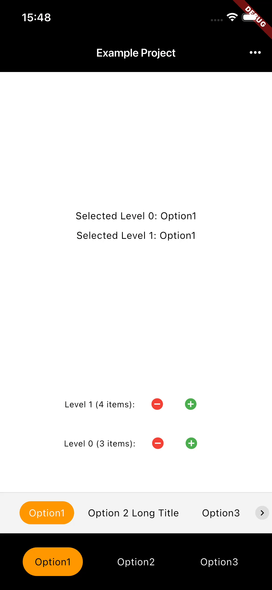

# Animated Options Bar

A production-ready Flutter package for animated tabbar/scrollbar components with smooth selection animations. The widget automatically detects whether to use tabbar mode (full width) or scrollbar mode (horizontal scrolling) based on available space.



## Features

- ✨ Smooth sliding and resizing animations when selection changes
- 🔄 Automatic layout mode detection (tabbar vs scrollbar)
- 🎨 Configurable styling through `OptionsBarConfig`
- 🔧 Generic implementation works with any item type
- 📱 String items supported with auto-detection (no getId/getLabel needed)
- 🚫 Support for disabled items with visual feedback
- ♿ Built-in accessibility support
- 🚀 Production-ready with comprehensive error handling

## Installation

Add this package to your `pubspec.yaml`:

```yaml
dependencies:
  animated_options_bar:
```

Or if using a local path:

```yaml
dependencies:
  animated_options_bar:
    path: packages/animated_options_bar
```

## Usage

### Basic Example with String Items

For String items, `getId` and `getLabel` are optional and will be auto-detected:

```dart
import 'package:animated_options_bar/animated_options_bar.dart';

final config = OptionsBarConfig(
  textPadding: EdgeInsets.symmetric(horizontal: 18.0, vertical: 12.0),
  borderRadius: 50.0,
  itemSpacing: 16.0,
  scrollEdgePadding: 16.0,
  activeTextColor: Colors.black,
  inactiveTextColor: Colors.white,
  selectionColor: Colors.orange,
  animationDuration: Duration(milliseconds: 300),
  centerOptions: true,
);

AnimatedOptionsBar<String>(
  items: ['Option 1', 'Option 2', 'Option 3'],
  selectedId: 'Option 1',
  onItemSelected: (id) => setState(() => selectedId = id),
  // Optional: Disable specific items
  isItemEnabled: (id) => id != 'Option 3',
  config: config,
)
```

### With Custom Items

For custom item types, `getId` and `getLabel` are required:

```dart
class MyItem {
  final String id;
  final String label;
  
  const MyItem({required this.id, required this.label});
}

final config = OptionsBarConfig(
  textPadding: EdgeInsets.symmetric(horizontal: 14.0, vertical: 8.0),
  borderRadius: 20.0,
  itemSpacing: 8.0,
  scrollEdgePadding: 8.0,
  activeTextColor: Colors.white,
  inactiveTextColor: Colors.black,
  selectionColor: Colors.orange,
  animationDuration: Duration(milliseconds: 300),
);

AnimatedOptionsBar<MyItem>(
  items: [
    MyItem(id: '1', label: 'First'),
    MyItem(id: '2', label: 'Second'),
  ],
  selectedId: '1',
  onItemSelected: (id) => setState(() => selectedId = id),
  getId: (item) => item.id,
  getLabel: (item) => item.label,
  config: config,
)
```

### Automatic Layout Detection

The widget automatically detects whether to use tabbar mode (full width distribution) or scrollbar mode (horizontal scrolling) based on available space. No manual configuration needed!

```dart
// Automatically uses tabbar mode if items fit, scrollbar mode if they overflow
final config = OptionsBarConfig(
  textPadding: EdgeInsets.symmetric(horizontal: 18.0, vertical: 12.0),
  borderRadius: 50.0,
  itemSpacing: 16.0,
  scrollEdgePadding: 16.0,
  activeTextColor: Colors.black,
  inactiveTextColor: Colors.white,
  selectionColor: Colors.orange,
);

AnimatedOptionsBar<String>(
  items: items,
  selectedId: selectedId,
  onItemSelected: (id) => setState(() => selectedId = id),
  config: config,
)
```

## Configuration

### Custom Configuration

Create a custom configuration by instantiating `OptionsBarConfig` with your desired values:

```dart
final customConfig = OptionsBarConfig(
  textPadding: EdgeInsets.symmetric(horizontal: 20.0, vertical: 10.0),
  borderRadius: 25.0,
  itemSpacing: 12.0,
  scrollEdgePadding: 16.0,
  activeTextColor: Colors.blue,
  inactiveTextColor: Colors.grey,
  disabledTextColor: Colors.grey.withOpacity(0.5), // Optional: Color for disabled items
  selectionColor: Colors.blue,
  animationDuration: Duration(milliseconds: 400),
  textStyle: TextStyle(fontSize: 16), // Optional custom text style
  backgroundColor: Colors.grey[100], // Optional background color
  arrowInset: 4.0, // Optional: distance of scroll arrows from edges
  arrowButtonSize: 20.0, // Optional: size of scroll arrow buttons
  centerOptions: true, // Optional: center options in the bar
);
```

## Parameters

### Required Parameters

- `items`: List of items to display (cannot be empty)
- `selectedId`: Currently selected item ID
- `onItemSelected`: Callback when an item is selected
- `config`: Styling configuration (`OptionsBarConfig`) - includes `selectionColor` and `animationDuration`

### Optional Parameters

- `getId`: Function to extract ID from an item (required for non-String types, auto-detected for String)
- `getLabel`: Function to extract label from an item (required for non-String types, auto-detected for String)
- `isItemEnabled`: Function to check if an item is enabled (optional, returns `true` by default)

### Production Ready

- ✅ StatefulWidget with proper state management
- ✅ Cached text measurements for performance
- ✅ Comprehensive error handling
- ✅ Accessibility support (Semantics widgets)
- ✅ Edge case handling (empty items, invalid selection, etc.)
- ✅ Comprehensive test coverage

## Example App

See `example/main.dart` for a complete example screen demonstrating both layout modes and different configurations.


## License

See LICENSE file for details.
